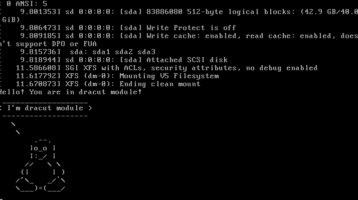

# otus_startsystem
<h1>Домашняя работа</h1>
<h3>Часть 1: попасть в систему без пароля</h3>
Способ 1: init=/bin/sh 
Прописываем в конце строки linux16: init=/bin/sh и нажимаем ctrl+x  

 

Система загрузилась

 

Способ 2: rd.break 
Прописываем в конце строки linux16: rd.break и нажимаем ctrl+x 

 

Система загружена 

 

Способ 3: init=/sysroot/bin/sh 

 

Система загружена 

 

<h3>Часть 2: переименование volume group в lvm</h3>
<a href=typescript>Лог действий</a>
<h3>Часть 3: добавление модуля в initrd</h3>
<a href=initrd>Лог действий</a>

 

